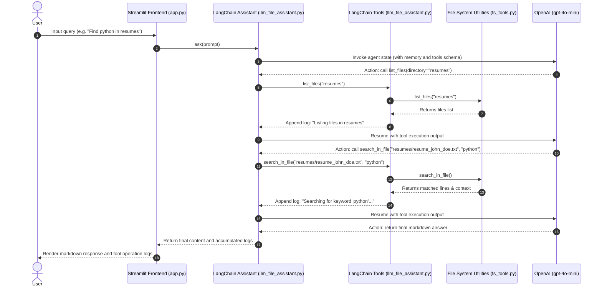

# 📂 LLM-powered File Assistant: A LangChain & Streamlit Intelligent Agent

LLM-powered File Assistant is a premium, AI-driven local document manager and query engine. It allows users to interact with local files (TXT, PDF, DOCX) inside the resumes directory using natural language. 

The application features a responsive **Streamlit** dashboard as a web frontend and is powered by a stateful **LangChain (LangGraph)** agent in the backend, which autonomously executes local file system operations via custom tools.

---

## 🚀 Key Features

### 🧠 LangGraph React Agent
*   **Autonomous Tool Use:** Built using LangGraph's `create_react_agent` to decide when to list files, read their content, search for keywords, or write summary outputs.
*   **Conversation Memory:** Maintains agent memory/history to understand follow-up queries contextually.

### 📂 Multi-Format File Reader & Utilities
*   **Plain Text (.txt):** Parsed using Python's standard file reader.
*   **Adobe PDF (.pdf):** Extracted using [pypdf](file:///c:/Users/HP/LLM_powered_File_system/requirements.txt).
*   **Microsoft Word (.docx):** Extracted using [python-docx](file:///c:/Users/HP/LLM_powered_File_system/requirements.txt).

### 🔍 Context-Aware Keyword Search
*   **Case-Insensitive Scanner:** Searches inside files for matches.
*   **Surrounding Context:** Returns matching lines along with surrounding context lines (up to 5 lines per match) for rich LLM responses.

### 📤 Interactive Web UI & CLI
*   **Streamlit Dashboard:** Featuring a premium dark look, sidebar file list, upload capability, and an active log tracker.
*   **Command Line Interface:** Dual execution mode allowing terminal-based interactive queries.

---

## 🏗️ Architecture & Component Flow

The application follows a clean modular design separating the frontend, agent orchestration layer, and local OS interface:

```
  USER INTERFACE (Streamlit UI / CLI) ◄───► AGENT ENGINE (llm_file_assistant.py) ◄───► FILE UTILS (fs_tools.py) ◄───► LOCAL STORAGE
```

1.  **UI Layer ([app.py](file:///c:/Users/HP/LLM_powered_File_system/app.py)):** Manages Streamlit state, renders custom CSS styling, handles resume uploads, and manages conversation streams.
2.  **Agent Orchestration ([llm_file_assistant.py](file:///c:/Users/HP/LLM_powered_File_system/llm_file_assistant.py)):** Builds the LangChain tools, initiates `ChatOpenAI` (`gpt-4o-mini`), compiles the stateful React agent, and runs the CLI loop.
3.  **Local OS Interface ([fs_tools.py](file:///c:/Users/HP/LLM_powered_File_system/fs_tools.py)):** Executes file system commands ([read_file](file:///c:/Users/HP/LLM_powered_File_system/fs_tools.py#L6-L35), [list_files](file:///c:/Users/HP/LLM_powered_File_system/fs_tools.py#L36-L57), [write_file](file:///c:/Users/HP/LLM_powered_File_system/fs_tools.py#L59-L71), and [search_in_file](file:///c:/Users/HP/LLM_powered_File_system/fs_tools.py#L73-L102)).

### Request Lifecycle Sequence



---

## 🛠️ Technology Stack

*   **Frontend:** Streamlit
*   **Agent framework:** LangChain, LangGraph
*   **LLM Provider:** OpenAI (`gpt-4o-mini`)
*   **File Parsers:** `pypdf`, `python-docx`
*   **Configuration:** `python-dotenv`
*   **Styling:** Custom Vanilla CSS injected via Streamlit

---

## 🚀 Getting Started

### Prerequisites
*   Python 3.10+
*   An OpenAI API Key

### Installation

1.  **Clone the Repository:**
    ```bash
    git clone <your-repo-url>
    cd LLM_powered_File_system
    ```

2.  **Create and Activate Virtual Environment:**
    ```bash
    python -m venv venv
    # Windows:
    venv\Scripts\activate
    # macOS/Linux:
    source venv/bin/activate
    ```

3.  **Install Required Dependencies:**
    ```bash
    pip install -r requirements.txt
    ```

4.  **Set Environment Variables:**
    Create a `.env` file in the root folder and add your OpenAI API Key:
    ```env
    OPENAI_API_KEY=your-openai-api-key-here
    ```

---

## 💻 Running the Application

### Option 1: Streamlit Web UI (Recommended)
Launch the web interface:
```bash
streamlit run app.py
```
Open `http://localhost:8501` in your web browser.

### Option 2: Interactive Terminal CLI
Run the assistant directly in your command prompt/terminal:
```bash
python llm_file_assistant.py
```
Interact using text prompts and type `exit` to quit.

---

## 📁 Repository Structure

*   [app.py](file:///c:/Users/HP/LLM_powered_File_system/app.py): Entry point for the Streamlit web dashboard and sidebar file manager.
*   [llm_file_assistant.py](file:///c:/Users/HP/LLM_powered_File_system/llm_file_assistant.py): Houses tool definitions, ChatOpenAI setup, LangGraph configuration, and CLI client.
*   [fs_tools.py](file:///c:/Users/HP/LLM_powered_File_system/fs_tools.py): Extensible module for reading (PDF, Word, Text), writing, listing, and parsing files.
*   [requirements.txt](file:///c:/Users/HP/LLM_powered_File_system/requirements.txt): Declares Python libraries needed for LLM connectivity, PDF/Word parsing, and UI rendering.
*   [resumes/](file:///c:/Users/HP/LLM_powered_File_system/resumes): Default workspace directory monitored by the explorer.
